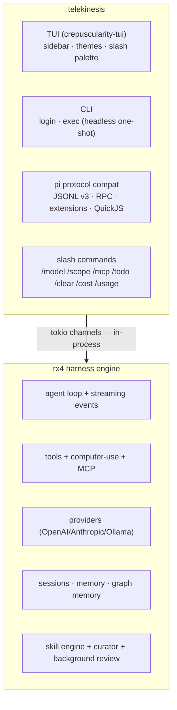
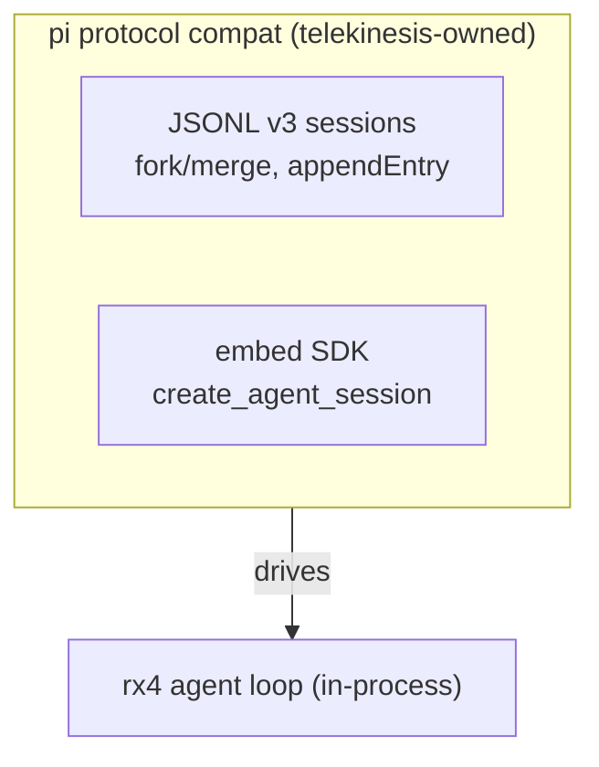
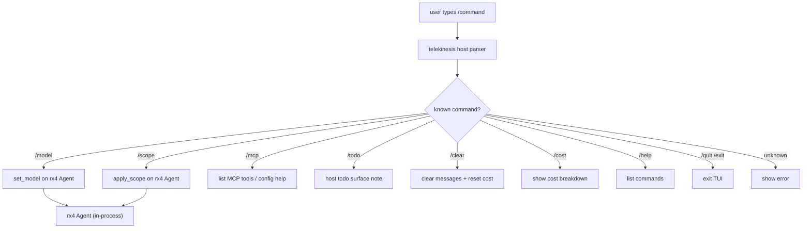

# telekinesis

## Product

**CLI + TUI host** for the **rotary (rx4)** agent harness engine.

- UX: minimal/fast (pi-first, codex second)
- TUI built with crepuscularity-tui (ratatui-based)
- No harness reimplementation — rx4 owns the loop
- **Owns pi protocol compat** (moved from rotary): JSONL v3 sessions, RPC
  over stdin/stdout, pi tool name mapping, extension protocol via QuickJS,
  capability policy, SDK surface

## Architecture



## Stack

- **Rust** — the entire product is Rust
- crepuscularity-tui (`ui/tui`) — ratatui-based TUI with hot-reloadable
  `shell.crepus` template — **primary surface**
- **rx4** crate — git `tschk/rotary` @ `441ce52` for harness APIs. Default `tk` features:
  providers + builtin-tools. Opt-in: `mcp`, `search` (darash), computer-use,
  skills, graph-memory. `--features full` enables all of those.
- tokio — async runtime, channels between TUI and agent loop
- **pi protocol compat** — JSONL v3 sessions and embed SDK (dead RPC/extension
  surfaces removed)

## UI surfaces

| Surface | Path | Status | Notes |
|---|---|---|---|
| TUI | `ui/tui` | ✅ Active | Primary surface, ratatui-based, in-process rx4 |
| GUI | `ui/gui` | 🧪 Experimental | GPUI native window; embeds rx4 directly today |

## Pi protocol layer



## Slash command flow



## Commands (required quality)

```bash
cd ui/tui && cargo build
cd ui/tui && cargo run
cd ui/tui && cargo test
cd ui/tui && cargo clippy
```

## Rules

- TUI currently uses rx4 directly in-process via tokio channels. Shared host
  runtime owns future multi-surface transport; do not add surface-specific
  harness loops.
- New agent features land in **rotary (rx4)** first, then surface via slash
  commands here. Hosts call `rx4::hashline`, `rx4::prewalk`, and `rx4::avo`.
- Prefer small slash commands that map to rx4 methods.
- telekinesis owns pi protocol compat — rotary no longer carries it.
- Product layer surfaces: MCP config (`ui/tui/src/mcp_config.rs` + `/mcp`,
  `--features mcp`), approval args, OS sandbox policy — do not reimplement
  harness loop.
- Optional AVO loop is scripts-only (`scripts/avo/`, `scripts/adapters/`,
  `docs/AVO.md`); NVIDIA AVO (arXiv:2603.24517), not Sample-then-Generate.
  Do not vendor avo-lite or add MCP/search to default features.
- No hard-coded API keys or telemetry.

## Commits

English Conventional Commits, e.g. `feat(tui): expose /scope and /permissions`.
