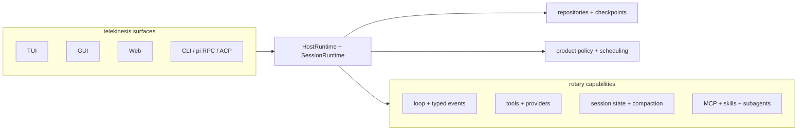

# ADR-001: Rotary engine and telekinesis host boundary

- Status: Accepted
- Date: 2026-08-02

## Context

rotary and telekinesis already describe a useful split, but implementation and
documentation disagree. Rotary is a single crate whose reusable agent engine
coexists with ACP, IPC, SSE, slash, and binary host wiring. Telekinesis has
surface-specific orchestration, pi compatibility, and persistence concerns
inside the TUI path. GUI and web transport claims are also ahead of current
code, and an old research note still describes a Zig backend.

Cline provides a useful comparison: keep the agent loop stateless and
capability-focused, keep session orchestration and host lifecycle above it,
and expose structured events and approval callbacks to clients.

## Decision

Keep rotary as the reusable engine and telekinesis as the product host.
Preserve the `rx4` facade during migration; improve internal module seams
before considering a crate split.

### Rotary owns

- Agent loop, turn state, providers, model routing, tools, and computer use.
- Permission and sandbox primitives, including pluggable async authorization.
- Session state, snapshot types, compaction algorithms, and lifecycle events.
- MCP, skills, memory, graph-memory, and subagent capabilities.
- Pure engine contracts and deterministic behavior; no product scheduling.

### Telekinesis owns

- `HostRuntime` and `SessionRuntime` lifecycle orchestration.
- Storage repositories, JSONL/SQLite wiring, workspace checkpoints, and resume.
- Product policy, scheduling, MCP configuration, skill scheduling, and
  worktree choices.
- Pi JSONL v3, stdin/stdout RPC, QuickJS extensions, ACP, IPC, SSE, and slash
  commands.
- TUI, GUI, web, CLI, authentication, and presentation state.

### Contract rules

1. Rotary exposes typed calls, typed events, session snapshots, and approval
   requests; it does not render or select a host transport.
2. Telekinesis supplies authorizers, repositories, lifecycle decisions, and
   event subscribers; surfaces do not call engine internals directly after
   `HostRuntime` extraction.
3. Approval requests carry stable tool-call identity, structured input, policy
   context, and explicit allow/deny results. Host timeout behavior fails closed.
4. Session persistence is an adapter. Rotary owns the serializable state shape;
   telekinesis owns storage location, durability, checkpoints, and migration.
5. Compaction is an engine capability with pure inputs/outputs. Host policy
   selects trigger, strategy, and summarizer configuration.
6. One public `rx4` facade remains until at least two independent consumers
   require separate release or dependency boundaries.

## Target architecture

## Migration

1. Freeze and test public rx4 event, tool, provider, approval, and snapshot
   contracts.
2. Move rotary host adapters to telekinesis compatibility modules without
   changing wire behavior.
3. Extract `HostRuntime` and `SessionRuntime` from `ui/tui/src/main.rs`.
4. Route GUI and web through the host runtime; keep TUI in-process first.
5. Add repository and checkpoint adapters; retain current session formats
   behind them.
6. Separate skills runtime from marketplace/curation and subagent orchestration
   from worktree mechanics.
7. Add cross-repository contract tests, then remove duplicate host paths and
   stale architecture claims.

## Consequences

Positive:

- One engine contract serves TUI, GUI, web, CLI, and future hosts.
- Host policy becomes testable without running the agent loop.
- Rotary stays embeddable and avoids UI, transport, and storage coupling.
- Current in-process path remains fast while future IPC can be added at one
  host boundary.

Costs:

- Temporary adapter duplication during migration.
- Coordinated versioning between rx4 contracts and telekinesis adapters.
- Existing rotary host modules need deprecation and removal discipline.

## Non-goals

- No immediate workspace or crate split.
- No immediate IPC daemon requirement.
- No replacement of rx4 loop, provider, tool, or sandbox implementations.
- No copying of Cline's UI, telemetry, or JavaScript monorepo structure.
