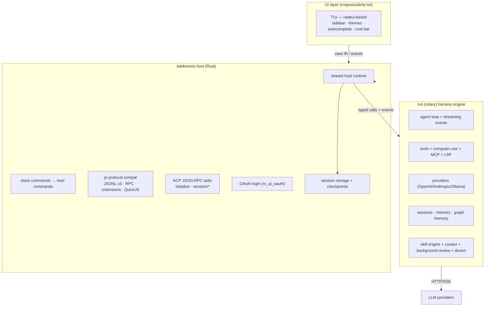
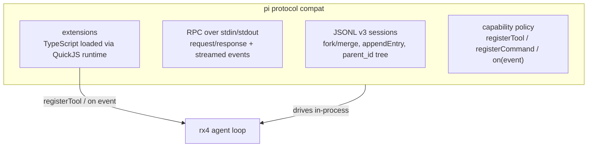
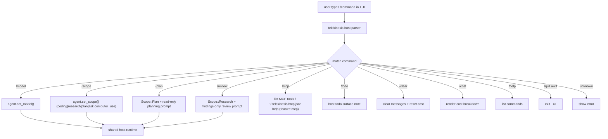

# telekinesis — architecture

> The original Zig-based plan has been replaced. telekinesis is now a Rust
> CLI + TUI host for the rx4 (rotary) harness engine.

## Goal

A minimal, fast AI coding agent CLI + TUI. pi-first UX, codex second. No
harness reimplementation — rx4 owns the loop.

## Boundary

rotary is the reusable engine. telekinesis is the product host. The engine
exposes capabilities and typed events; the host owns lifecycle, persistence,
transport, product policy, and presentation.

## Layers

## Pi protocol layer (telekinesis-owned)

telekinesis owns pi protocol compatibility, moved out of rotary:

- **Extensions**: TypeScript/JavaScript modules loaded via QuickJS. Host
  exposes a `Host` vtable translating pi-style capabilities
  (`registerTool`, `registerCommand`, `on`, `sendMessage`, `appendEntry`,
  `setModel`) into rx4 calls.
- **Skills**: pure Markdown capability packs (`SKILL.md`, YAML frontmatter),
  injected into the system prompt as `<available_skills>`. Distinct from
  extensions — passive knowledge, no tool registration.
- **Event lifecycle** (pi-aligned naming):
  `before_agent_start → agent_start → turn_start → message_start →
  message_update* → message_end → tool_call → tool_execution_start →
  tool_execution_end → tool_result → turn_end → agent_end`

## Slash command flow

## Wire to rx4

- rx4 is consumed as a published Cargo dependency. Coordinated local
  development may use a path dependency without changing host ownership.
- `ui/tui/src/main.rs` currently imports rx4 directly and drives the loop
  in-process. The target is a shared host runtime used by every surface.
- builtins + computer-use registered at startup; MCP stdio from
  `mcp_config.rs` best-effort; approvals render `ApprovalRequest.arguments`;
  OS sandbox via `Policy.with_os_sandbox(true)` + `enable_os_sandbox()`.
- Hooks observe lifecycle; engine does not yet return deny/modify from hooks.

## Decisions

- **Host boundary first**: keep current in-process tokio channels, but route
  them through a surface-neutral host runtime before adding IPC.
- **pi compat owned here**: rotary is a pure harness engine; protocol
  compat is a host concern.
- **ACP owned here**: `tk acp` is a thin JSON-RPC stdio adapter over the
  in-process rx4 agent. Rotary still exports `rx4::acp` behind `ipc`; that
  copy is follow-up deprecation, not the product surface.
- **crepuscularity-tui**: ratatui-based with a hot-reloadable `shell.crepus`
  template — same template can target other surfaces later.
- **New agent features land in rx4 first**, then surface via slash commands
  here.

## Ownership map

| Concern | Owner |
|---|---|
| Loop, providers, tools, engine policy primitives, compaction capability | rotary |
| Session model and snapshots | rotary |
| Session storage, checkpoints, lifecycle, scheduling | telekinesis host |
| MCP/skills/subagent capabilities | rotary |
| MCP configuration, skill scheduling, worktree/product policy | telekinesis host |
| Pi JSONL/RPC/QuickJS, ACP, IPC, SSE, slash commands | telekinesis host |
| TUI, GUI, web presentation | telekinesis surfaces |

## Migration

1. Preserve rx4 facade contracts for events, tools, providers, approvals, and
   session snapshots.
2. Move rotary host adapters (`acp`, `ipc`, `sse`, `slash`, binary wiring) to
   telekinesis adapters without changing behavior.
3. Extract `HostRuntime` and `SessionRuntime` from TUI orchestration.
4. Put persistence and checkpoint implementations behind host-owned adapters.
5. Add cross-repository contract tests before deleting duplicate paths.

See [ADR-001](ADR-001-rotary-engine-telekinesis-host.md).

Inspired by t3code's typed ui/runtime boundary, codex noninteractive +
approvals, opencode multi-provider sessions, zero's tui, crush's hooks,
grok-build's dream memory — implemented as a thin host on a solid harness
engine.
