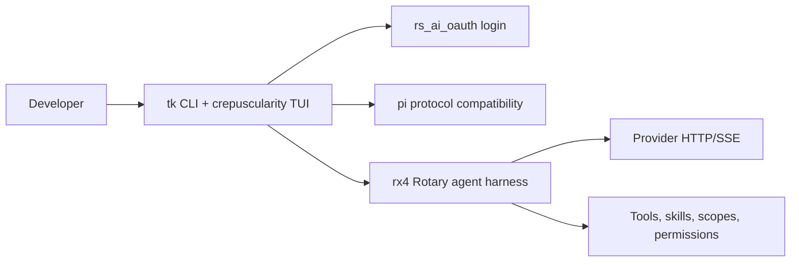

# telekinesis documentation

telekinesis is the MPL-2.0 CLI and TUI product. Its executable is `tk`; rotary is an embedded library dependency named `rx4`, not a second product binary.



## Guides

- [Usage](USAGE.md) — install features, CLI, OAuth, TUI slash commands and keys.
- [AVO](AVO.md) — avo-lite tick loop via `tk exec` adapters (scripts only).
- [Architecture](ARCHITECTURE.md) — product layers and the in-process event path.
- [Rotary integration](ROTARY.md) — the host/engine boundary and the rx4 API used by the TUI.
- [ADR-001](ADR-001-rotary-engine-telekinesis-host.md) — rotary engine and telekinesis host boundary.

## Feature inventory

- OAuth login for Grok, OpenAI, Claude, Gemini, Copilot, Kimi, and Antigravity.
- Rust TUI with streaming Markdown, slash-command autocomplete, sessions, themes, context usage, cost tracking, tool blocks, and permission prompts that show tool **arguments**.
- Pi-compatible JSONL v3 sessions and embed SDK (`create_agent_session`).
- In-process rx4 agent loop with scopes, builtins, OS sandbox policy, model routing, multi-agent coordination, and secret redaction. MCP (`--features mcp`), darash search (`--features search`), computer-use, skills, and graph memory are compiled with `--features full` (or the matching single feature).
- Slash: `/model`, `/scope`, `/plan`, `/review`, `/mcp`, `/search`, `/todo`, `/cost`, `/usage`, `/clear`, `/help`, `/quit`.

## Verification

```bash
cd ui/tui
cargo build
cargo test
cargo clippy
```

For an authenticated smoke test, run `tk login grok`, then start `tk` and verify a streamed response. OAuth approval remains in the user's browser and is not part of an unattended test.

## Layout

```
telekinesis/
  ui/tui/           Rust TUI (crepuscularity-tui + rx4)
  ui/gui/           optional GPUI companion
  ui/shell.crepus   hot-reloadable TUI template
  docs/             architecture and usage docs
  references/       git submodules (t3code, pi, zed, opencode, crush, zero)
```

