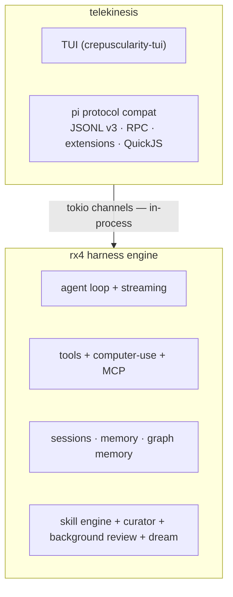

# telekinesis ↔ rotary (rx4)

rotary (rx4) is the **agent harness engine**. telekinesis is the
**CLI + TUI** host. telekinesis also owns the **pi protocol compat** layer
(moved out of rotary).

## Architecture



## Wire

- rx4 is consumed as a git dependency on `tschk/rotary` (`feat/rx4-agent-harness`
  / `441ce52`) with `default-features = false`. The default `tk` surface keeps
  `providers` + `builtin-tools` only. Hosts call rotary APIs; they do not own
  hashline, prewalk, or AVO dialects.
- `ui/tui/src/main.rs` currently imports rx4 directly and drives the loop
  in-process via tokio channels. A shared telekinesis host runtime is the
  target boundary for additional surfaces.
- builtin tools registered at startup; computer-use and MCP tools are
  feature-gated (`computer-use` / `mcp`, or `--features full`). MCP from
  `~/.telekinesis/mcp.json` is connected best-effort when the feature is on:

```rust
let mut tools = ToolRegistry::new();
register_builtin_tools(&mut tools);
rx4::computer_use::register_tools(&mut tools);
// host: connect_mcp_tools(&mut tools) — stdio + http + sse from ~/.telekinesis/mcp.json
agent.set_tools(tools);
agent.set_policy(Policy::workspace_write().with_os_sandbox(true));
let _ = agent.enable_os_sandbox();
```

## Bump harness

```bash
# path dep: rebuild against local rotary
cd ui/tui && cargo check
# crates.io (when not on path):
# cargo update -p rx4 && cargo test
```

## rx4 API used by TUI

`Agent::new`, `set_scope`, `set_model`, `set_provider`, `set_tools`,
`set_workspace_root`, `set_policy`, `enable_os_sandbox`, `subscribe`, `prompt`,
`Scope` (Coding/Research/Plan/Ask/ComputerUse), `ToolRegistry`,
`register_builtin_tools`, `computer_use::register_tools`, `McpClient` (feature `mcp`).

Harness APIs (do not reimplement):

- `rx4::hashline` / `HashlineSight` — tagged reads; builtin `read` with
  `"hashline": true` and `hashline_edit`
- `rx4::prewalk::Prewalk` — `RX4_PREWALK`, `RX4_SMOL_MODEL`, `RX4_INVESTIGATE_MODEL`
- `rx4::avo` — `objective_f`, `lineage_p_t`, `commit_if_better`, `StallDetector`

Events: `Rx4Event` lifecycle (AgentStart, TurnStart, MessageStart/Delta/End,
ToolCall, **ApprovalRequired** (includes `arguments`), ToolExecutionStart/End,
TurnEnd, AgentEnd, Error) delivered over a tokio channel.

Hooks: `HookRegistry` lifecycle observe (`BeforeTool`/`AfterTool`/…). Engine
hooks are currently fire-and-forget (`HookFn`); deny/modify lands when engine
ships gating — host should not invent a second permission system.

## Boundary

rotary owns reusable engine capabilities and typed events. telekinesis owns
product lifecycle, persistence, scheduling, transport, pi compatibility, and
surface presentation. Rotary modules currently containing host adapters are
migration inventory, not a reason to duplicate host behavior.

See the canonical decision record:
[telekinesis ADR-001](https://github.com/tschk/telekinesis/blob/main/docs/ADR-001-rotary-engine-telekinesis-host.md).

## rx4 (rotary) modules

| module | role |
|---|---|
| `agent` | event-driven loop, tool registry, streaming, parallel tool execution |
| `hashline` | tagged reads + fail-closed PUT/CUT/MV/REM (`hashline_edit`) |
| `prewalk` | investigate → apply model switch on first write |
| `avo` | scored lineage, commit-if-better, stall detect |
| `provider` | multi-provider openai-compatible client, websocket prewarming |
| `tools` | builtins: read/write/edit/bash/grep/find/ls; scope lists also name spawn_agent/code_intel aliases |
| `computer_use` | computer-use tools (`cu_*`, 13) via Praefectus |
| `session` | session tree (fork/merge) + store |
| `compaction` | semantic context compaction with token estimation |
| `models` | model registry with compat config and override logic |
| `skill_engine` | skill creation from experience, bayesian confidence, skill.md export |
| `background_review` | background review loop — observe turns, distill learning signals |
| `skill_curator` | skill lifecycle curator — Active→Stale→Archived, consolidation |
| `embeddings` | vector embeddings for semantic skill matching (Gemini / Ollama) |
| `graph_memory` | knowledge graph, pagerank, community detection, dream consolidation |
| `dream_scheduler` | dream cycle runner — graph consolidation capability (host schedules) |
| `model_router` | tiered routing (lite/standard/heavy/subagent), proactive monitor |
| `multiagent` | coordinator/worker/reviewer/researcher roles, event bus |
| `subagent` | subagent spawning with worktree isolation |
| `mcp` | json-rpc 2.0 over **stdio / http / sse** (`McpClient`/`McpRegistry`); host loads config + registers tools |
| `lsp` | json-rpc lsp client, diagnostics, references, definition |
| `sandbox` | OS sandbox via `Policy.enable_os_sandbox` + `Agent::enable_os_sandbox` (seatbelt/bwrap) |
| `secrets` | secret detection and redaction |
| `prompt_cache` | anthropic cache_control, cache stats tracking |
| `cost` | per-model pricing registry, session cost breakdown |
| `repomap` | pagerank-ranked symbol extraction, token-budgeted summary |
| `routing` | smart routing (simple/strong classifier) |
| `rollout` | rollout persistence, trace writer |
| `sse` | optimized sse parser |
| `marketplace` | plugin marketplace with installer and blocklist |

> pi protocol compat is **no longer in rx4** — telekinesis owns it
> (JSONL v3 sessions, RPC, extension runtime via QuickJS).

When registered, the host may also surface engine extras: `web_fetch`,
`todo`, `spawn_agent`, plan-scope tools, and LSP tools. Project instruction
files (`agents.md` etc.) load on startup. A bundled workflow skill (inspect,
plan, implement, verify) auto-activates from `skills/` when the `skills`
feature is on.

## Computer-use

Enabled via the `computer-use` Cargo feature on telekinesis (`--features full`
or `--features computer-use`), which turns on `rx4/computer-use`
(`dep:praefectus`). `rx4::computer_use::register_tools(&mut tools)` registers
the 13 `cu_*` tools through Praefectus. Native Rust, no FFI. The default `tk`
binary does not link Praefectus.

## MCP host config

Compiled into `tk` only with `--features mcp` (or `full`). Without the
feature, `/mcp` and discover are no-ops that tell you to rebuild.

File: `~/.telekinesis/mcp.json`

```json
{
  "servers": [
    {
      "name": "fs",
      "transport": "stdio",
      "command": "npx",
      "args": ["-y", "@modelcontextprotocol/server-filesystem", "."]
    },
    {
      "name": "remote",
      "transport": "http",
      "url": "https://example.invalid/mcp"
    }
  ]
}
```

- `stdio` servers: host spawns via `McpClient::connect_stdio`, lists tools,
  registers `mcp__{name}__{tool}` on the agent `ToolRegistry`.
- `http` / `sse`: host connects via `McpClient::connect_http` / `connect_sse / connect_sse_get` (optional headers).
  Startup never fails if MCP is down.
- `/mcp` slash command lists connected tools or prints config help.

## Approvals

`Event::ApprovalRequired(ApprovalRequest)` carries `tool_name`, `arguments`,
`reason`, flags. TUI permission prompt and system line show **args**, not name
only. Hosts that implement `Approver` receive full `ToolCall`.
